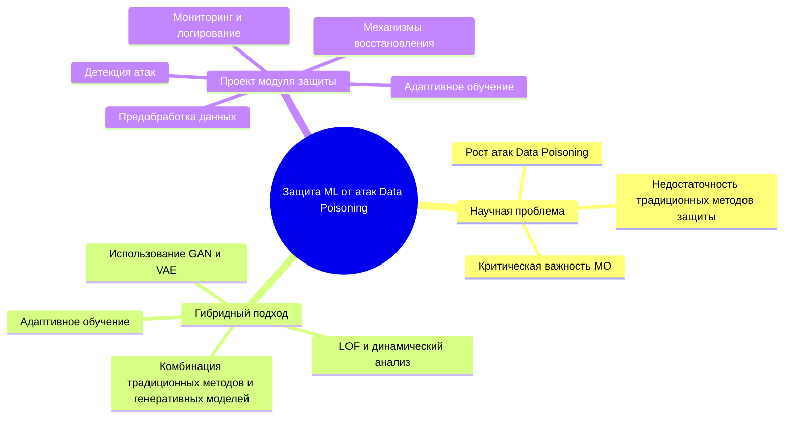

📌 Детальная архитектура проекта HADAMT_Prod

Проект HADAMT_Prod представляет собой гибридную архитектуру для защиты моделей машинного обучения от атак Data Poisoning, включающую механизмы обнаружения, фильтрации, мониторинга и адаптивного обновления. В составе проекта есть основной защитный модуль и подмодуль тестирования атак (test_attack), который служит для валидации системы перед развертыванием.

📂 Общая структура проекта
```
HADAMT_Prod/                
│── data/                   # 📂 Хранилище данных (входные, обработанные, отравленные)
│   ├── raw/                # 📂 Исходные сырые данные (загруженные пользователем)
│   ├── processed/          # 📂 Обработанные данные (очищенные и нормализованные)
│   ├── poisoned/           # 📂 Данные после тестовой атаки
│   ├── logs/               # 📂 Логи обработки данных
│── models/                 # 📂 Обученные модели
│   ├── base_model.pkl      # ✅ Базовая модель (до защиты)
│   ├── defended_model.pkl  # 🛡️ Модель после защиты
│   ├── poisoned_model.pkl  # ⚠️ Модель, обученная на отравленных данных
│── src/                    # 📂 Основной код проекта
│   ├── preprocessing.py    # 🏗️ Модуль предобработки данных
│   ├── training.py         # 🏋️‍♂️ Обучение модели
│   ├── defense.py          # 🔍 Защитный модуль (фильтрация + аугментация)
│   ├── monitoring.py       # 📊 Мониторинг дрейфа и аномалий
│   ├── utils.py            # ⚙️ Вспомогательные функции
│── test_attack/            # ⚠ Подмодуль симуляции атак
│   ├── data/               # 📂 Данные, изменённые атакой
│   ├── scripts/            # 📂 Скрипты атакующего модуля
│   │   ├── poison_gan.py   # 🧪 Отравление данных через GAN
│   │   ├── poison_noise.py # 🎲 Добавление случайного шума
│   │   ├── poison_label.py # 🏷 Подмена меток классов (Label Flipping)
│   ├── notebooks/          # 📂 Анализ атаки в Jupyter Notebook
│   │   ├── attack_analysis.ipynb   # 📊 Разбор эффективности атак
│   ├── results/            # 📂 Итоговые отчёты после тестов
│── notebooks/              # 📂 Аналитика и тестирование защиты
│   ├── 1_EDA.ipynb         # 📊 Исследовательский анализ данных
│   ├── 2_Training.ipynb    # 🏋️‍♂️ Обучение модели
│   ├── 3_Defense.ipynb     # 🛡️ Проверка защитных механизмов
│   ├── 4_Testing.ipynb     # 🧪 Тестирование устойчивости
│── configs/                # 📂 Конфигурационные файлы
│   ├── settings.yaml       # ⚙️ Основные настройки системы
│   ├── model_config.json   # 🏗️ Параметры модели (гиперпараметры)
│── logs/                   # 📂 Логи работы модели и защиты
│── reports/                # 📂 Автоматически генерируемые отчёты
│── requirements.txt        # 📦 Зависимости проекта
│── README.md               # 📖 Документация проекта
│── setup.py                # 🛠️ Скрипт установки
```
🔍 Детализация каждого модуля

📂 1. data/ – Управление входными и выходными данными
•	raw/ – Исходные данные, загруженные пользователем.
•	processed/ – Очищенные и нормализованные данные после предобработки.
•	poisoned/ – Данные, изменённые атакующими методами.
•	logs/ – Логи обработки данных.

📂 2. models/ – Обученные модели
•	base_model.pkl – Базовая модель (до применения защиты).
•	defended_model.pkl – Модель после защиты (использует фильтрацию и аугментацию).
•	poisoned_model.pkl – Модель, обученная на отравленных данных (для тестирования).

📂 3. src/ – Основной код проекта
•	preprocessing.py – Обработка данных перед обучением.
•	training.py – Основной скрипт обучения модели.
•	defense.py – Реализация защитных механизмов (Isolation Forest + LOF + аугментация данных).
•	monitoring.py – Отслеживание дрейфа данных и аномалий.
•	utils.py – Вспомогательные функции (логирование, метрики).

📂 4. test_attack/ – Подмодуль тестирования атак

📂 data/ – Данные атак
•	Хранятся обработанные и отравленные выборки.

📂 scripts/ – Реализация атак
•	poison_gan.py – Использование генеративно-состязательных сетей (GAN) для отравления данных.
•	poison_noise.py – Добавление случайного шума в признаки данных.
•	poison_label.py – Подмена меток классов (Label Flipping).

📂 notebooks/ – Jupyter-ноутбуки для анализа атак
•	attack_analysis.ipynb – Визуализация атак и оценка их эффективности.

📂 results/ – Итоговые отчёты
•	Сравнение метрик до и после атак.

📂 5. notebooks/ – Аналитика и тестирование
•	1_EDA.ipynb – Исследовательский анализ данных.
•	2_Training.ipynb – Обучение модели.
•	3_Defense.ipynb – Тестирование защитных механизмов.
•	4_Testing.ipynb – Проверка работы защиты после атак.

📂 6. configs/ – Конфигурация
•	settings.yaml – Основные настройки системы.
•	model_config.json – Гиперпараметры модели.

📂 7. logs/ – Логи работы системы
•	Логирование аномалий, метрик и работы защитных алгоритмов.

📂 8. reports/ – Автоматически генерируемые отчёты
•	Автоматический анализ атак и защиты.

📂 9. README.md – Документация
•	Полное описание проекта и инструкции по установке.

🚀 Как развернуть проект HADAMT_Prod?

Проект HADAMT_Prod можно развернуть на Windows, macOS и Linux. Ниже представлены инструкции для каждой из операционных систем.

1️⃣ Установка зависимостей

Перед установкой убедитесь, что у вас установлен Python 3.8+ и Git.

🔹 Windows
1.	Установите Python 3.8+ и Git.
2.	Откройте PowerShell и выполните:
```
git clone https://github.com/your-repo/HADAMT_Prod.git
cd HADAMT_Prod
python -m venv env
env\Scripts\activate
pip install -r requirements.txt
```
🔹 Linux (Ubuntu/Debian)
1.	Установите Python и Git (если не установлены):
```
sudo apt update
sudo apt install python3 python3-venv python3-pip git
```
2.	Склонируйте репозиторий и установите зависимости:
```
git clone https://github.com/your-repo/HADAMT_Prod.git
cd HADAMT_Prod
python3 -m venv env
source env/bin/activate
pip install -r requirements.txt
```
🔹 macOS
1.	Установите Homebrew (если не установлен):
```
/bin/bash -c "$(curl -fsSL https://raw.githubusercontent.com/Homebrew/install/HEAD/install.sh)"
```
2.	Установите Python и Git:
```
brew install python git
```
3.	Склонируйте репозиторий и установите зависимости:
```
git clone https://github.com/your-repo/HADAMT_Prod.git
cd HADAMT_Prod
python3 -m venv env
source env/bin/activate
pip install -r requirements.txt
```
2️⃣ Запуск базовой модели
```
python src/training.py
```
3️⃣ Запуск защитного механизма
```
python src/defense.py
```
4️⃣ Симуляция атаки (по желанию)
```
python test_attack/scripts/poison_gan.py
python test_attack/scripts/poison_noise.py
```
🛠 Дополнительно
•	Для автоматического логирования используйте MLflow или TensorBoard:
```
mlflow ui  # Открыть интерфейс MLflow
tensorboard --logdir=logs/  # Открыть TensorBoard
```
•	Если работаете в Docker, создайте контейнер:
```
docker build -t hadamt_prod .
docker run -it --rm hadamt_prod
```
mindmap для эссе

